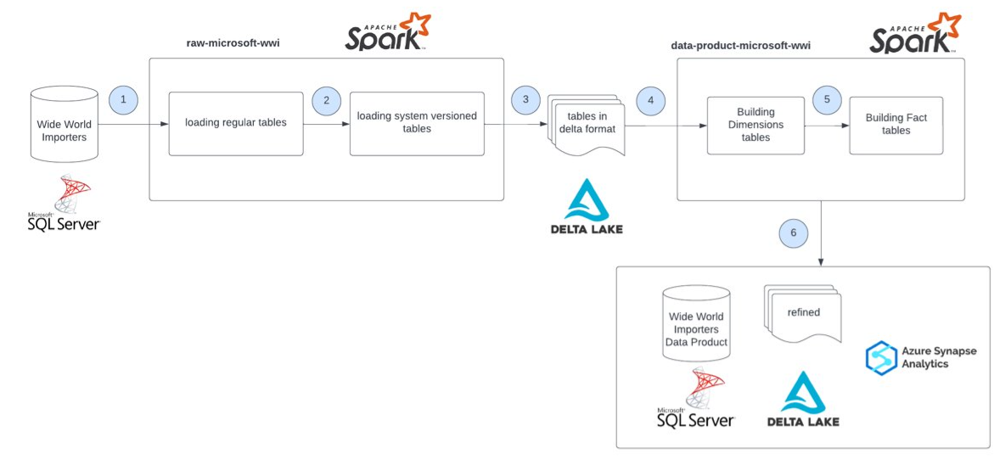

# Wide World Importers data transformation using Spark

## Project Description
“data-product-microsoft-wwi” project is the part of [IACDA accelerator](https://kb.epam.com/display/EPMADPAF/IACDA+-+Infrastructure+as+Code+Data+Accelerator) data pipelines. It was designed using the sample database for the fictitious company [Wide World Importers](https://learn.microsoft.com/en-us/sql/samples/wide-world-importers-what-is?view=sql-server-ver16) and rely on the Apache Spark and use Delta as a data format for storing data. “data-product-microsoft-wwi” project reads delta tables created by “raw-microsoft-wwi” project, changes the data structure, and creates Data Warehouse (transformation part).  The logic of the pipelines is displayed on the schema below.  

  

This README describes how to work with the Project in your local environment. For more information on this data pipeline in general and instructions how to run it in Databricks please go to the [IACDA Databricks Data Pipelines](https://kb.epam.com/display/EPMADPAF/Databricks+Data+Pipelines).  

## Project repository main components

1. Guides for Project local run
- `/documentation` – guides for various operating systems: Linux, Windows 10, Windows 11 with WSL

2. Installation files
- `.env.dist` – distributive for environment settings (delta tables destination path etc.)
- `install.sh` – installation script
- `pyproject.toml`, `poetry.toml` – configuration files

3. Sources to restore the WideWorldImporters Database in docker container - optional part (Database within the docker is only needed if you want to download application data into the Microsoft SQL Server using Spark)
- `Makefile`, `docker-compose.yml`, `init_product_db.sql`

4. Project main resources
- `/src/raw_microsoft_wwi` – Loaders (Readers, Writers, Filter), Transformers, Configuration files etc.
- `/src/tests` – Loaders, Transformers, Fixtures for Project tests
- `/src/run_locally.py` – script for Project launch

5. Project deploy tools
- `/azure_pipelines` – ".yml" pipelines to continuously test, build, and deploy Project code
- `/databricks_notebooks` and `/databricks_jobs` – resources for Project run in Azure Databricks

6. Test data - optional part
- `/data/raw` – previously recorded delta tables from “raw-microsoft-wwi” project to launch “data-product-microsoft-wwi” without “raw-microsoft-wwi” running first.  


7. E2E Testing tools
- `/e2e-testing-test-data` - data-product area e2e testing expected delta tables


## How to Install and Run the Project
Please, follow the guide that matches your operating system for local run:
- [Linux](documentation/run_locally/Ubuntu_22.04.md)
- [Windows 10](documentation/run_locally/Windows_10.md)
- [Windows 11 + WSL](documentation/run_locally/Windows_11.md)  

## How to Use the Project
Please note, that you have to build a `.whl` file before run the project “data-product-microsoft-wwi” in Databricks. Wheels (.whl file) - component of the Python ecosystem that helps to make package installs just work. Open the local “data-product-microsoft-wwi” project and run below command in console.

```shell
$ poetry build -f wheel 
```

As a result it creates a "dist" folder with `.whl` file. Then you have to open a `Databricks/Compute -> Your cluster -> Libraries -> Install new`. For more information about running in Databricks please go to the [IACDA Databricks Data Pipelines](https://kb.epam.com/display/EPMADPAF/Databricks+Data+Pipelines)  

## Unit tests
Run pytest as:
```shell
pytest src/tests
```
If you want to see a code coverage:
```shell
pytest --cov=data_product_microsoft_wwi src/tests
```


## E2E Tests
E2E testing is a part of Databricks CI/CD workflow. E2E tests is running automatically on deployment to Staging environment. See more details about CI/CD processes [here](https://kb.epam.com/pages/viewpage.action?pageId=1774421408)
E2E tests is executing on truncated version of [Wide World Importers database](https://learn.microsoft.com/en-us/sql/samples/wide-world-importers-what-is?view=sql-server-ver16).
To run E2E tests manually on Databricks, you have to:
1. Specify job run_mode parameter - is_e2e to True(by default it's False)
2. Specify raw_area_path variable - path of actual delta tables
3. Specify e2e_expected_data_path variable - location of expected delta tables
4. Wait till job execution will be finished :)

After execution, you will get message with result of your tests. In case if tests failed - you will get detailed message with root cause of your fail.
For more detailed instructions how to run E2E tests in Databricks please visit [How to run E2E Tests on Databricks](https://kb.epam.com/display/EPMADPAF/How+to+run+E2E+Tests+on+Databricks)


## Troubleshooting
* If after the app running you got en Py4JJavaError `ModuleNotFoundError`.  
  It means Spark can't find the required jar files that he needs. Method to resolve. Try one of them in this sequence:    
  * Set `export PATH=$PATH:~/.ivy2/jars`
  * Then add the command above to your `~/.bashrc` file
  * Reboot your computer. It can help if you just installed Java.
  * Copy required jar files from `.ivy2/jars` to `.venv/lib/python3.8/site-packages/pyspark/jars`
  

* If you have an exception when trying to run the app locally:  
   _java.net.ConnectException: Call From <Host name> to localhost:9000 failed on connection exception: java.net.ConnectException: Connection refused_  
   It probably means that Spark trying get files from HDFS by default.  
   To resolve it try to add the prefix `file://` before delta tables path in `.env` file.  
   E.g. `DELTA_TABLES_DEST=file:///<YOUR_PATH>/delta-tables/source`
        `DELTA_TABLES_DEST=file:///<YOUR_PATH>/delta-tables/destination`
  
  
* If you got an error when trying to establish a connection to db like this:  
  _The driver could not establish a secure connection to SQL Server by using Secure Sockets Layer (SSL) encryption.  
  Error: "PKIX path building failed: sun.security.provider.certpath.SunCertPathBuilderException: unable to find valid certification path to requested target"._  
  To resolve this issue try to `trustServerCertificate=true` as an option in db connection URL in the `run_locally.py`