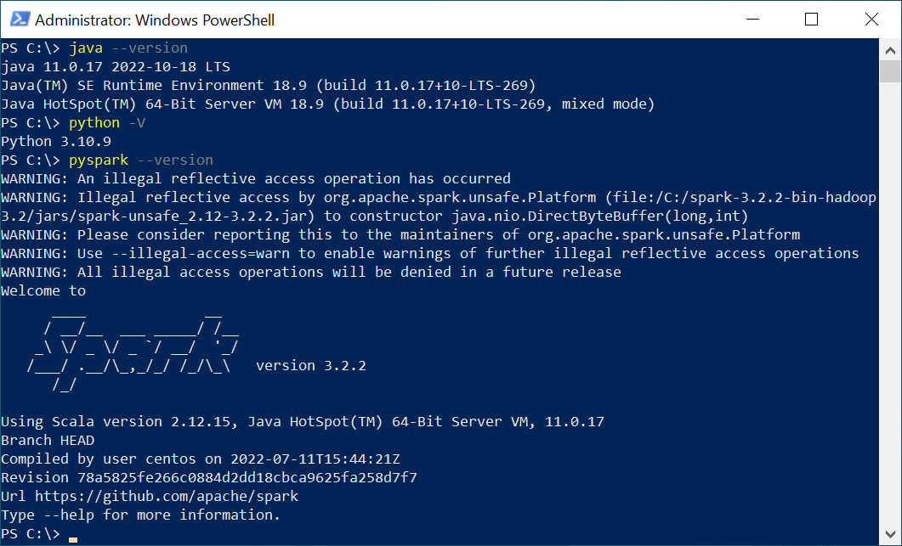
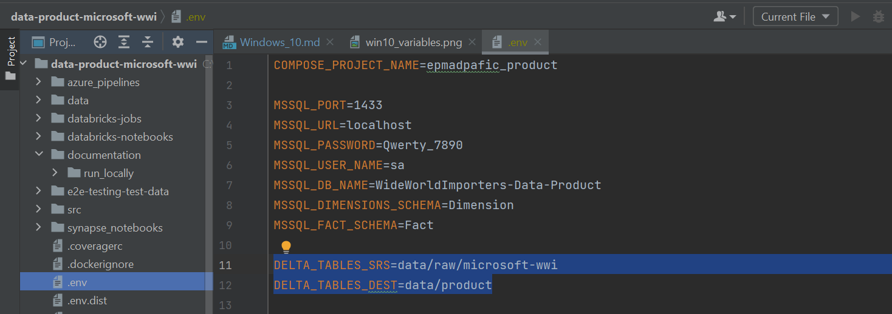
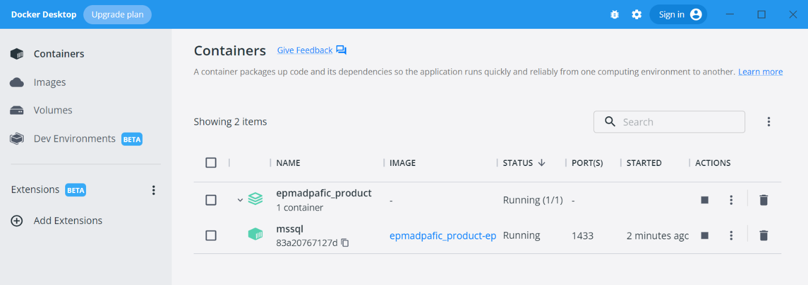
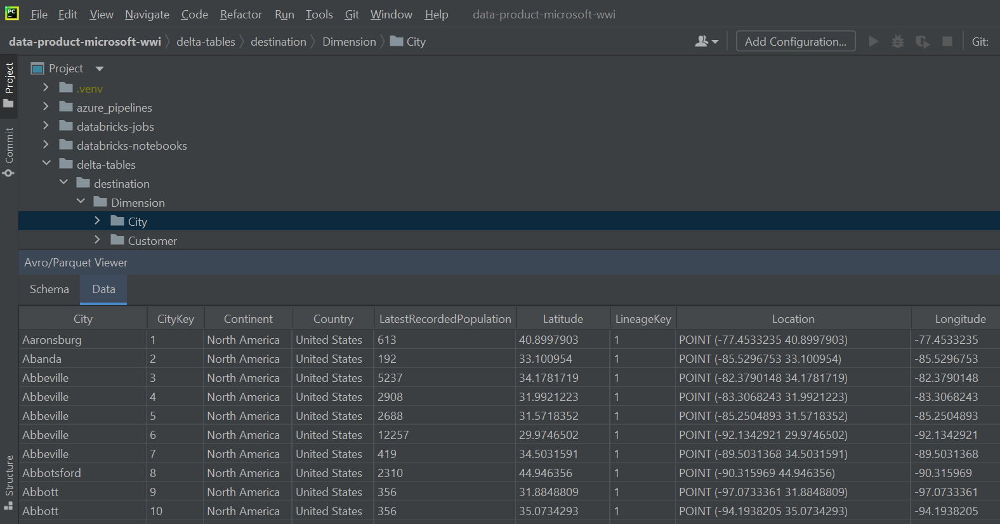

# “data-product-microsoft-wwi” local run on Windows 10
> If you have “raw-microsoft-wwi” project installed on your machine, you can skip prerequisite tools installation.

### Prerequisite tools
- Java (JDK) is required, please set up [JDK 11](https://www.oracle.com/java/technologies/javase/jdk11-archive-downloads.html) version (run `java --version` in the Terminal and check it).
- [Python](https://www.python.org/downloads/windows/) 3.8 - 3.10 installed (run `python -V` in the Terminal and check Python version)
- spark 3.2.2 version with hadoop 3.2 (download from [dirrect link](https://archive.apache.org/dist/spark/spark-3.2.2/spark-3.2.2-bin-hadoop3.2.tgz) or find in [official sources](https://spark.apache.org/downloads.html))
- [winutils](https://github.com/cdarlint/winutils) for hadoop 3.2 on Windows  

Set Environment Variables after the Spark and Hadoop installation:
- Create `HADOOP_HOME` variable with its path as value, for example `C:\winutils-master\hadoop-3.2.2`
- Create `SPARK_HOME` variable with its path as value, for example `C:\spark-3.2.2-bin-hadoop3.2`
- Add two values with Hadoop and Spark paths to the `Path` variable (in the "System variables" section), for example: `C:\spark-3.2.2-bin-hadoop3.2\bin` and `C:\winutils-master\hadoop-3.2.2\bin`
- Create `PYSPARK_PYTHON` variable (optional) with `python` value if you plan to use several Python versions on your PC. Please note, that priority version of Python should be at the top of variables list.

Please run `pyspark` in the Terminal and make sure that Python version in Pyspark log matches your Python version.  

### 1 Clone the “data-product-microsoft-wwi” project
Generate Git Credentials and clone the “data-product-microsoft-wwi” project from [EPAM repository](https://git.epam.com/epma-dpaf/iacda/data-pipelines/databricks-data-product-microsoft-wwi) to your local folder.

### 2 Fill all variables in “.env.dist” file and then copy it with renaming into “.env”
Please change "DELTA_TABLES_SRS" and "DELTA_TABLES_DEST" variables for delta tables. You can use sample dataset included in this application (option 1) or use previously recorded delta tables from “raw-microsoft-wwi” application on your local machine (option 2).  
> You can specify either <b>absolute</b> or <b>relative</b> path.
- Option 1 – variables example for using test delta tables
```shell
DELTA_TABLES_SRS=data/raw/microsoft-wwi
DELTA_TABLES_DEST=data/product
```
  
- Option 2 – variables example for using “raw-microsoft-wwi” delta tables
```shell
DELTA_TABLES_SRS=../raw-microsoft-wwi/delta-tables/destination
DELTA_TABLES_DEST=delta-tables/destination
```  
User password "MSSQL_PASSWORD" must be specified according to the SQL Server Policy. Other variables changing is optional, defaults can be used.  

### 3 Create virtual environment in “venv” project folder and activate it
```shell
python -m venv venv  
```

```shell
.\venv\Scripts\activate  
```

### 4 Install [poetry](https://python-poetry.org/docs/#installing-with-the-official-installer)
```shell
pip install poetry  
```

### 5 Install Project dependencies
```shell
poetry install --with dev-dependencies  
```

### 6 Copy the microsoft jdbc driver jars into Spark/jars
Copy the [mssql-jdbc-8.4.0.jre11](https://kb.epam.com/download/attachments/1755616936/mssql-jdbc-8.4.0.jre11.jar?version=1&modificationDate=1658487873772&api=v2)
and [spark-mssql-connector_2.12_3.0-1.0.0-alpha](https://kb.epam.com/download/attachments/1755616936/spark-mssql-connector_2.12_3.0-1.0.0-alpha.jar?version=1&modificationDate=1658487875128&api=v2). Place them into spark/jars.

### 7 Run the database (optional)
> Please skip this step if you are going to use delta tables as a loading destination. Database within the docker is only needed if you want to download application data into the Microsoft SQL Server using Spark  

You have to set up [Docker](https://www.docker.com/products/docker-desktop/) Desktop first (if not installed). Please run `docker ps` in the Terminal and make sure that it shows not error response from daemon.  

#### 7.1 First launch:
Please use [chocolatey](https://community.chocolatey.org/courses/installation/installing) to run makefile  
- Option 1. Run the following commands in PowerShell (as administrator)
```shell
Set-ExecutionPolicy Bypass -Scope Process -Force; [System.Net.ServicePointManager]::SecurityProtocol = [System.Net.ServicePointManager]::SecurityProtocol -bor 3072; iex ((New-Object System.Net.WebClient).DownloadString('https://community.chocolatey.org/install.ps1'))
choco install make
```
- Option 2. Run the following commands in Terminal (as administrator)
```shell
@"%SystemRoot%\System32\WindowsPowerShell\v1.0\powershell.exe" -NoProfile -InputFormat None -ExecutionPolicy Bypass -Command "iex ((New-Object System.Net.WebClient).DownloadString('https://community.chocolatey.org/install.ps1'))" && SET "PATH=%PATH%;%ALLUSERSPROFILE%\chocolatey\bin"
choco install make
```

Download WideWorldImporters database files and restore them within the docker image
```shell
make restore
```

After DB restoring docker container is already up and connected to 1433 port with credentials you set in “.env”. Please check group “epmadpafic_product” running with “mssql” container.  

#### 7.2 Second and further docker container starting
```shell
make up
```

### 8 Run the “data-product-microsoft-wwi” project
```shell
poetry run console load -d delta
```  
and you will get delta tables on path you set into “.env” by environment variable named “DELTA_TABLES_DEST”  



