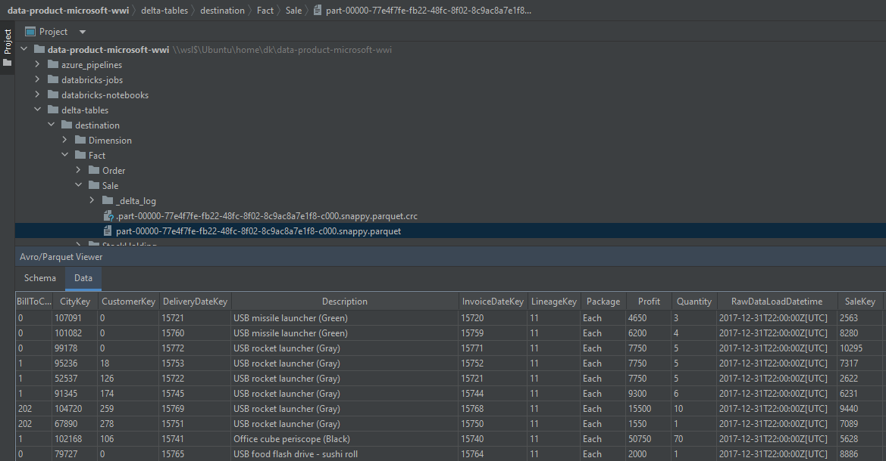

# “data-product-microsoft-wwi” local run on Windows 11 with WSL
> If you have “raw-microsoft-wwi” project installed on your machine, you can skip prerequisite tools installation as well as steps 1, 5, 7.

### Prerequisite tools
- Java (JDK) is required. Please set up JDK 11 version.
```shell
$ sudo apt-get install openjdk-11-jdk
```

### 1 Install Linux on Windows with WSL (if not installed)
Windows 11 currently doesn't support delta, so you have to use [WSL](https://learn.microsoft.com/en-us/windows/wsl/install).

### 2 Download the “data-product-microsoft-wwi” project
Download the “data-product-microsoft-wwi” project from [EPAM repository](https://git.epam.com/epma-dpaf/iacda/data-pipelines/databricks-data-product-microsoft-wwi) to your ”/home/<user_name>” folder in WSL  


### 3 Fill all variables in “.env.dist” file and then copy it with renaming into “.env”
Please change "DELTA_TABLES_SRS" and "DELTA_TABLES_DEST" variables for delta tables. User password must be specified according to the SQL Server Policy. Other variables changing is optional, defaults can be used  
> You can use previously recorded delta tables from “raw-microsoft-wwi” application on your local machine (option 1) or use test dataset included in this application (option 2)  
- Option 1 – variables example for using “raw-microsoft-wwi” delta tables
```shell
DELTA_TABLES_SRS=/home/<user_name>/raw-microsoft-wwi/delta-tables/destination
DELTA_TABLES_DEST=/home/<user_name>/data-product-microsoft-wwi/delta-tables/destination
```  

- Option 2 – variables example for using test delta tables
```shell
DELTA_TABLES_SRS=/home/<user_name>/data-product-microsoft-wwi/data/raw/microsoft-wwi
DELTA_TABLES_DEST=/home/<user_name>/data-product-microsoft-wwi/data/product
```  
### 4 Install virtual environment
Install [“python venv”](https://docs.python.org/3/library/venv.html) module, then create and activate your virtual environment, for example
```shell
$ sudo apt install python3.8-venv
$ python3 -m venv venv
$ source venv/bin/activate
```

### 5 Install [poetry](https://python-poetry.org/docs/#installing-with-the-official-installer) (if not installed)
```shell
$ curl -sSL https://install.python-poetry.org | python3 -
```

### 6 Check the “pyproject.toml” file and install dependencies
Install dependencies using
```shell
$ poetry install
```

### 7 Copy the microsoft jdbc driver jars into Spark/jars
Copy the [mssql-jdbc-8.4.0.jre11](https://kb.epam.com/download/attachments/1755616936/mssql-jdbc-8.4.0.jre11.jar?version=1&modificationDate=1658487873772&api=v2)
and [spark-mssql-connector_2.12_3.0-1.0.0-alpha](https://kb.epam.com/download/attachments/1755616936/spark-mssql-connector_2.12_3.0-1.0.0-alpha.jar?version=1&modificationDate=1658487875128&api=v2). Place them into spark/jars, for example:
```shell
/home/<user_name>/data-product-microsoft-wwi/venv/lib/python3.8/site-packages/pyspark/jars
```

### 8 Run the database (optional)
> Please skip this step if you are going to use delta tables as a loading destination. Database within the docker is only needed if you want to download application data into the Microsoft SQL Server using Spark  

You have to set up [Docker](https://www.docker.com/products/docker-desktop/) Desktop first (if not installed).

#### 8.1 First launch:
Download WideWorldImporters database files and restore them within the docker image
```shell
$ make restore
```
After DB restoring docker container is already up and connected to 1433 port with credentials you set in “.env”. Please check group “epmadpafic_product” running with “mssql” container.  


#### 8.2 Second and further docker container starting
```shell
$ make up
```

### 9 Run the “data-product-microsoft-wwi” project
```shell
$ poetry run console load -d delta
```
and you will get delta tables on path you set into “.env” by environment variable named “DELTA_TABLES_DEST”  



