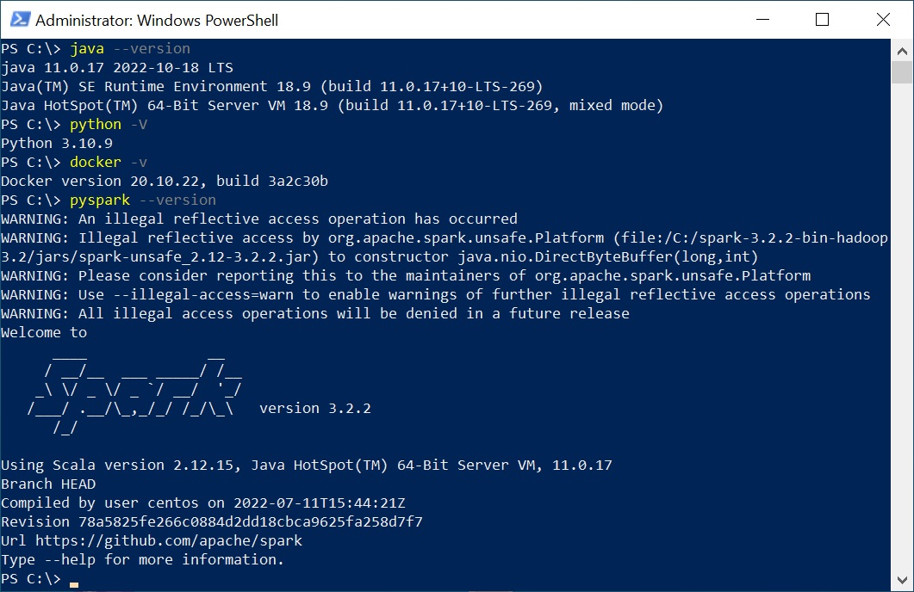
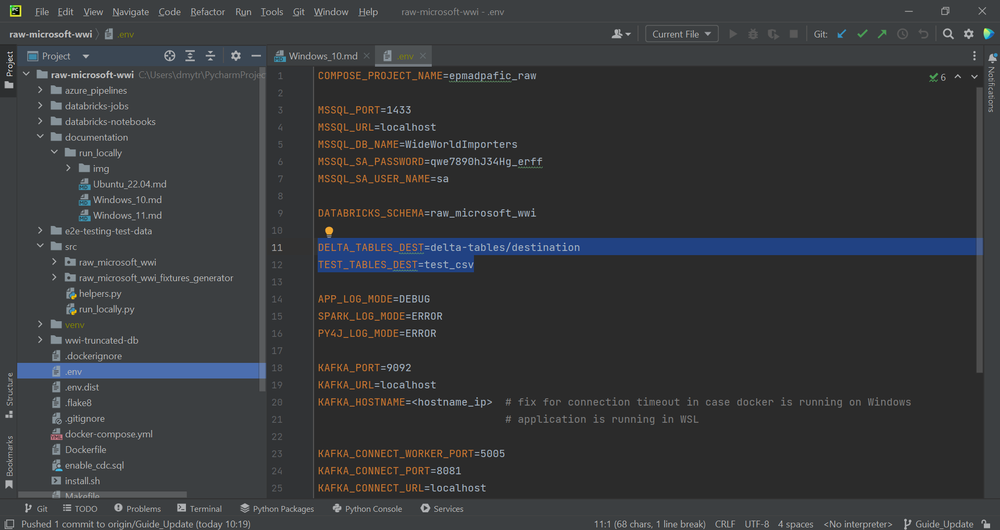
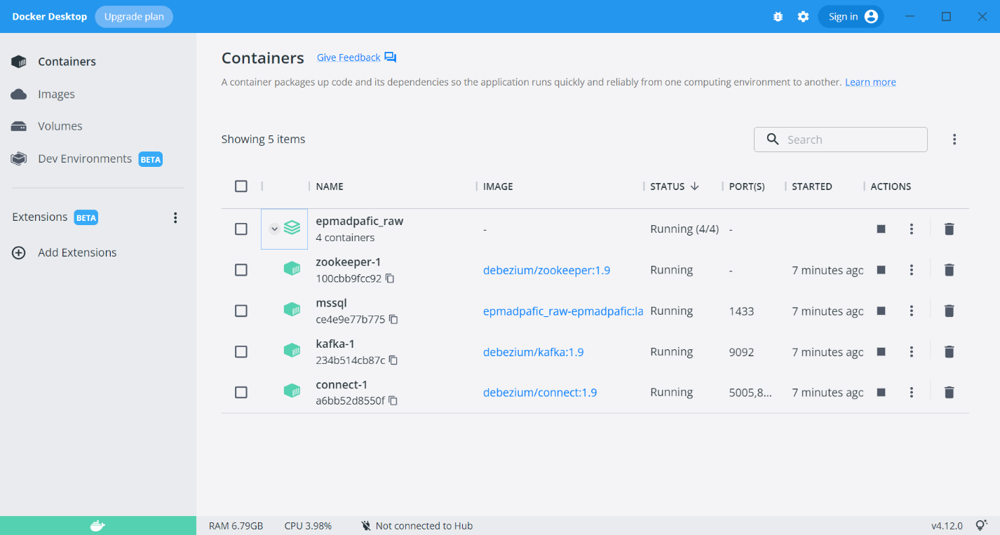
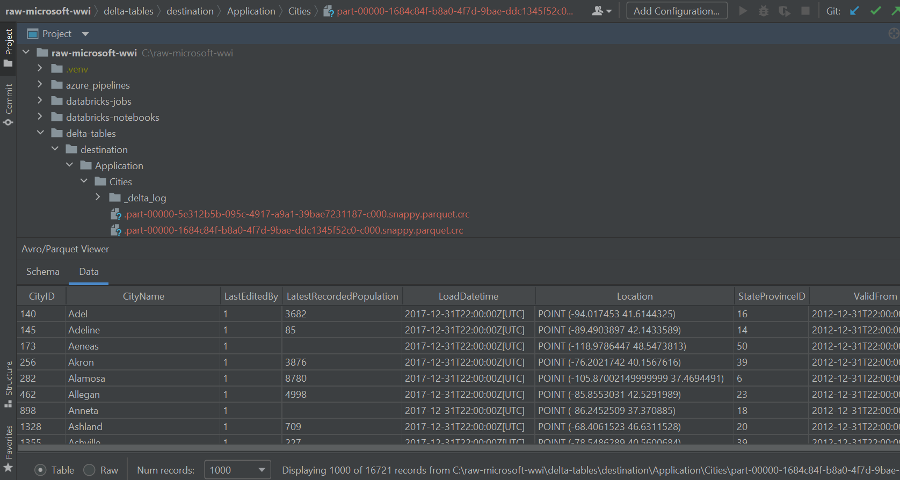

# “raw-microsoft-wwi” local run on Windows 10

### Prerequisite tools
- Java (JDK) is required, please set up [JDK 11](https://www.oracle.com/java/technologies/javase/jdk11-archive-downloads.html) version (run `java --version` in the Terminal and check it).
- [Python](https://www.python.org/downloads/windows/) 3.8 - 3.10 installed (run `python -V` in the Terminal and check Python version)
- [Docker](https://www.docker.com/products/docker-desktop/) Desktop installed (run `docker ps` in the Terminal and make sure that it shows not error response from daemon)
- Spark 3.4.1 version with hadoop 3.3 (download from [dirrect link](https://dlcdn.apache.org/spark/spark-3.4.1/spark-3.4.1-bin-hadoop3.tgz) or find in [official sources](https://spark.apache.org/downloads.html))
- [winutils](https://github.com/cdarlint/winutils) for hadoop 3.3 on Windows  

Set Environment Variables after the Spark and Hadoop installation:
- Create `HADOOP_HOME` variable with its path as value, for example `C:\winutils-master\hadoop-3.3.5`
- Create `SPARK_HOME` variable with its path as value, for example `C:\spark-3.4.1-bin-hadoop3.3`
- Add two values with Hadoop and Spark paths to the `Path` variable (in the "System variables" section), for example: `C:\spark-3.4.1-bin-hadoop3.3\bin` and `C:\winutils-master\hadoop-3.3.5\bin`
- Create `PYSPARK_PYTHON` variable (optional) with `python` value if you plan to use several Python versions on your PC. Please note, that priority version of Python should be at the top of variables list.

Please run `pyspark` in the Terminal and make sure that Python version in Pyspark log matches your Python version.  


### 1 Download the “raw-microsoft-wwi” project
Generate Git Credentials and clone the “raw-microsoft-wwi” project from [EPAM repository](https://git.epam.com/epma-dpaf/iacda/data-pipelines/databricks-raw-microsoft-wwi) to your local folder.

### 2 Fill all variables in “.env.dist” file and then copy it with renaming into “.env”
Please change "DELTA_TABLES_DEST" and "TEST_TABLES_DEST" variables for delta tables and "EVENT_HUBS_NAMESPACE", "EVENT_HUBS_ACCESS_KEY_NAME", "EVENT_HUBS_ACCESS_KEY" if you want to stream data from Azure Eventhubs. Other variables changing is optional, defaults can be used. You can specify an <b>absolute</b> or <b>relative</b> path. Example for relative path:
```shell
DELTA_TABLES_DEST=delta-tables/destination
TEST_TABLES_DEST=test_csv
```  
  

### 3 Create virtual environment in “venv” project folder and activate it

```shell
python -m venv venv  
```

```shell
.venv\Scripts\activate  
```

### 4 Install [poetry](https://python-poetry.org/docs/#installing-with-the-official-installer)
```shell
pip install poetry  
```

### 5 Install Project dependencies
```shell
poetry install --with dev-dependencies  
```

### 6 Copy the microsoft jdbc driver jars into Spark/jars
Copy the [mssql-jdbc-8.4.0.jre11](https://kb.epam.com/download/attachments/1755616936/mssql-jdbc-8.4.0.jre11.jar?version=1&modificationDate=1658487873772&api=v2)
and [spark-mssql-connector_2.12_3.0-1.0.0-alpha](https://kb.epam.com/download/attachments/1755616936/spark-mssql-connector_2.12_3.0-1.0.0-alpha.jar?version=1&modificationDate=1658487875128&api=v2). Place them into spark/jars.

### 7 Run the database
#### 7.1 First launch:
Please use [chocolatey](https://community.chocolatey.org/courses/installation/installing) to run makefile  
- Option 1. Run the following commands in PowerShell (as administrator)
```shell
Set-ExecutionPolicy Bypass -Scope Process -Force; [System.Net.ServicePointManager]::SecurityProtocol = [System.Net.ServicePointManager]::SecurityProtocol -bor 3072; iex ((New-Object System.Net.WebClient).DownloadString('https://community.chocolatey.org/install.ps1'))
choco install make
```
- Option 2. Run the following commands in Terminal (as administrator)
```shell
"%SystemRoot%\System32\WindowsPowerShell\v1.0\powershell.exe" -NoProfile -InputFormat None -ExecutionPolicy Bypass -Command "iex ((New-Object System.Net.WebClient).DownloadString('https://community.chocolatey.org/install.ps1'))" && SET "PATH=%PATH%;%ALLUSERSPROFILE%\chocolatey\bin"
choco install make
```

Download WideWorldImporters database files and restore them within the docker image
```shell
make restore
```
After DB restoring docker container is already up and connected to 1433 port with credentials you set in “.env”. Please check multi-container group “epmadpafic_raw” running with 4 containers:
- “zookeeper-1”
- “mssql”
- “kafka-1”
- “connect-1”  

#### 7.2 Second and further docker container starting
```shell
make up
```

### 8 Run the “raw-microsoft-wwi” project
#### 8.1 Batch processing using JDBC connection
If you want to load data using batch processing via JDBC connection to the database:
```shell
poetry run console load -t 2018
```
and you will get delta tables with a raw data filtered till 2018-01-01 on path you set into “.env” by environment variable named “DELTA_TABLES_DEST”  


#### 8.2 Using Kafka and Debezium connector
If you want to load data using streaming from Kafka:
```shell
poetry run console load -m debezium
```
**Note:** At the first run using streaming from local Kafka, you may need to create Debezium connector by adding --create_connector in command:
```shell
poetry run console load -m debezium --create_connector
```
Before running a command, make sure that you have provided "KAFKA_CONNECT_PORT" and "KAFKA_CONNECT_URL" variables in .env file </br>

#### 8.3 Using Azure Eventhubs
If you want to change streaming source from Kafka to Azure Eventhubs:
```shell
poetry run console load -m debezium -s eventhubs
```