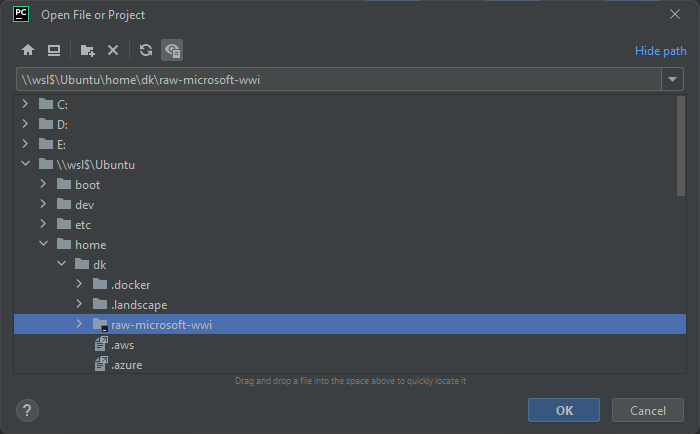
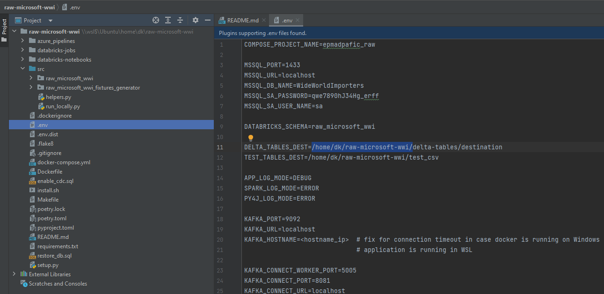
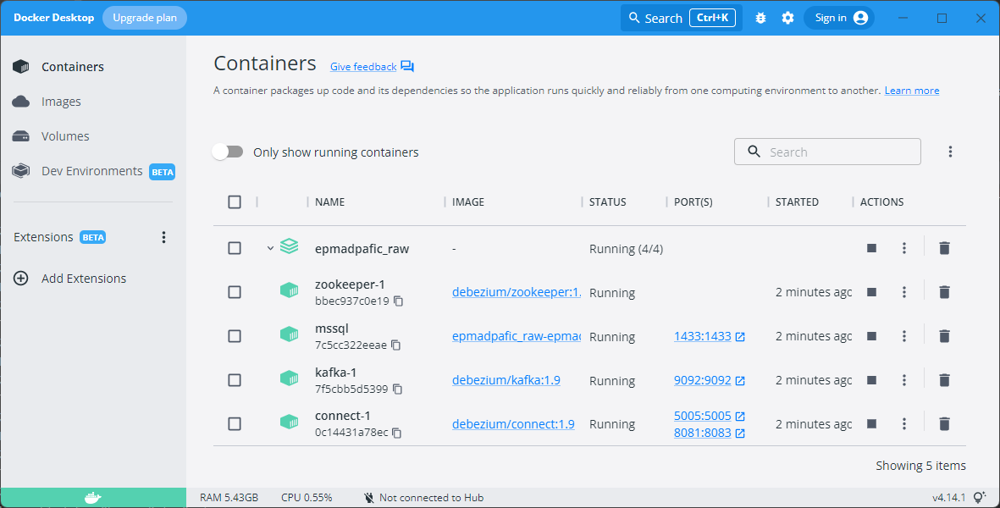
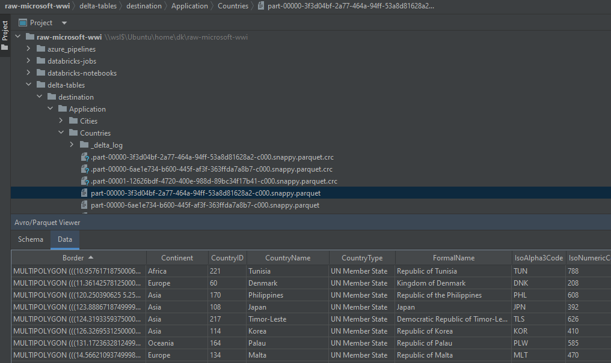

# “raw-microsoft-wwi” local run on Windows 11 with WSL

### Prerequisite tools
- [Docker](https://www.docker.com/products/docker-desktop/) Desktop
- Java (JDK) is required. Please set up JDK 11 version.
```shell
$ sudo apt-get install openjdk-11-jdk
```


### 1 Install Linux on Windows with WSL
Windows 11 currently doesn't support delta, so you have to use [WSL](https://learn.microsoft.com/en-us/windows/wsl/install).

### 2 Download the “raw-microsoft-wwi” project
Clone the “raw-microsoft-wwi” project from [EPAM repository](https://git.epam.com/epma-dpaf/iacda/data-pipelines/databricks-raw-microsoft-wwi) to your ”/home/<user_name>” folder and check it  

### 3 Fill all variables in “.env.dist” file and then copy it with renaming into “.env”
Please change "DELTA_TABLES_DEST" and "TEST_TABLES_DEST" variables for delta tables and "EVENT_HUBS_NAMESPACE", "EVENT_HUBS_ACCESS_KEY_NAME", "EVENT_HUBS_ACCESS_KEY" if you want to stream data from Azure Eventhubs. Other variables changing is optional, defaults can be used
```shell
DELTA_TABLES_DEST=/home/<user_name>/raw-microsoft-wwi/delta-tables/destination
TEST_TABLES_DEST=/home/<user_name>/raw-microsoft-wwi/test_csv
```  

### 4 Install virtual environment
Install [“python venv”](https://docs.python.org/3/library/venv.html) module, then create and activate your virtual environment, for example
```shell
$ sudo apt install python3.8-venv
$ python3 -m venv venv
$ source venv/bin/activate
```

### 5 Install [poetry](https://python-poetry.org/docs/#installing-with-the-official-installer)
```shell
$ curl -sSL https://install.python-poetry.org | python3 -
```

### 6 Check the “pyproject.toml” file and installs dependencies
Install dependencies using
```shell
$ poetry install
```

### 7 Copy the microsoft jdbc driver jars into Spark/jars
Copy the [mssql-jdbc-8.4.0.jre11](https://kb.epam.com/download/attachments/1755616936/mssql-jdbc-8.4.0.jre11.jar?version=1&modificationDate=1658487873772&api=v2)
and [spark-mssql-connector_2.12_3.0-1.0.0-alpha](https://kb.epam.com/download/attachments/1755616936/spark-mssql-connector_2.12_3.0-1.0.0-alpha.jar?version=1&modificationDate=1658487875128&api=v2). Place them into spark/jars, for example:
```shell
/home/<user_name>/raw-microsoft-wwi/venv/lib/python3.8/site-packages/pyspark/jars
```

### 8 Run the database
#### 8.1 First launch:
Download WideWorldImporters database files and restore them within the docker image
```shell
$ make restore
```
After DB restoring docker container is already up and connected to 1433 port with credentials you set in “.env”. Please check multi-container group “epmadpafic_raw” running with 4 containers:
- “zookeeper-1”
- “mssql”
- “kafka-1”
- “connect-1”  


#### 8.2 Second and further docker container starting
```shell
$ make up
```

### 9 Run the “raw-microsoft-wwi” project
If you want to load data using batch processing via JDBC connection to the database:
```shell
$ poetry run console load -t 2018
```
and you will get delta tables with a raw data filtered till 2018-01-01 on path you set into “.env” by environment variable named “DELTA_TABLES_DEST”  


If you want to load data using streaming from Kafka:
```shell
$ poetry run console load -m debezium
```
**Note:** At the first run using streaming from local Kafka, you may need to create Debezium connector by adding --create_connector in command:
```shell
$ poetry run console load -m debezium --create_connector
```
Before running a command, make sure that you have provided "KAFKA_CONNECT_PORT" and "KAFKA_CONNECT_URL" variables in .env file </br>

If you want to change streaming source from Kafka to Azure Eventhubs:
```shell
$ poetry run console load -m debezium -s eventhubs
```